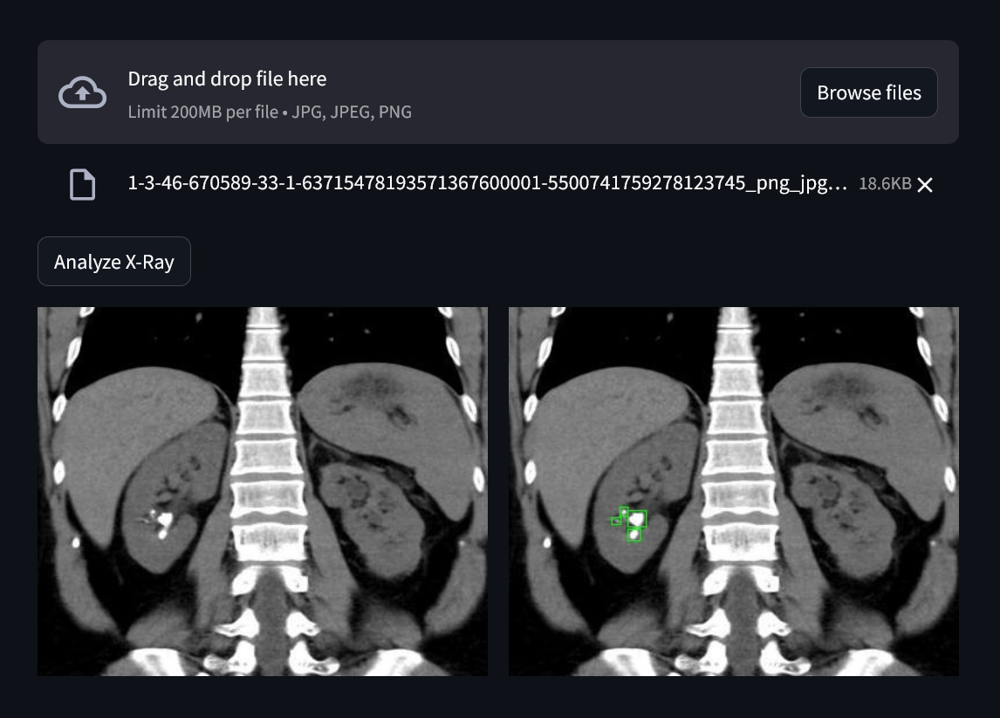

# Kidney Stone Detection

* The goal of this project is to build a kidney stone detection model which detects kidney stones from X-Ray images using bounding box annotations.

* A YOLOv8 model was trained based on a training set of kidney X-Ray images.

* The application's UI design and model deployment were done using Streamlit.

* Dataset: https://www.kaggle.com/datasets/safurahajiheidari/kidney-stone-images

* Application URL: https://kidneystone-vitalinsight.streamlit.app/

